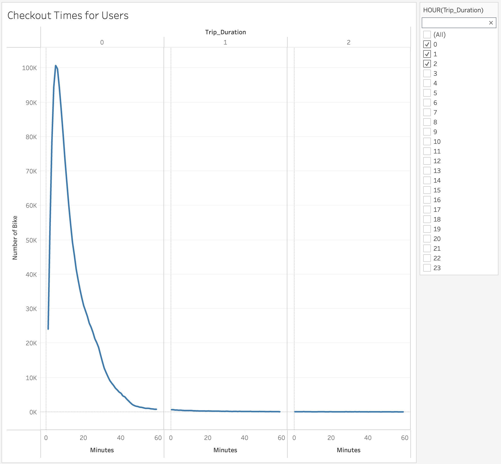
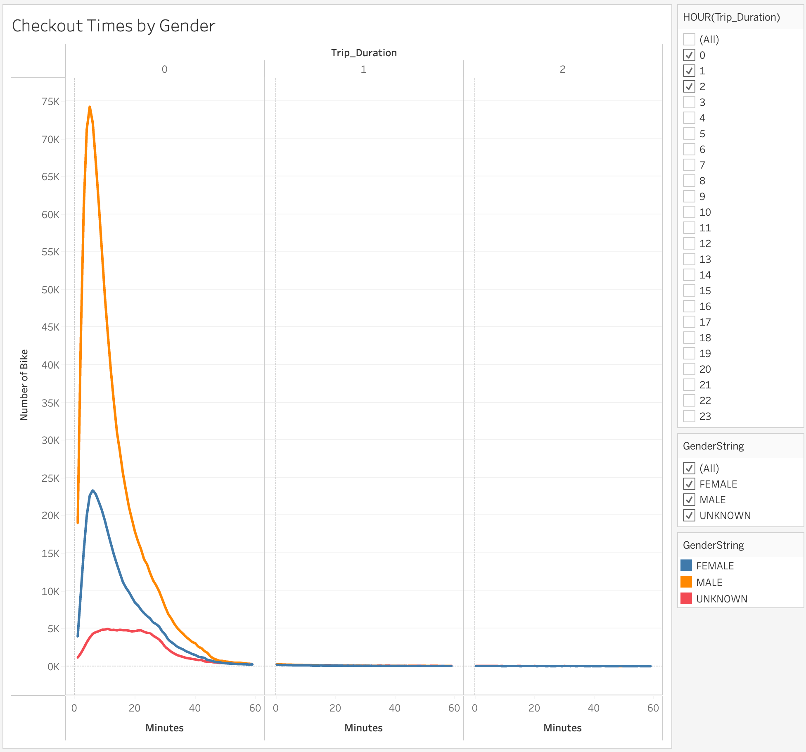
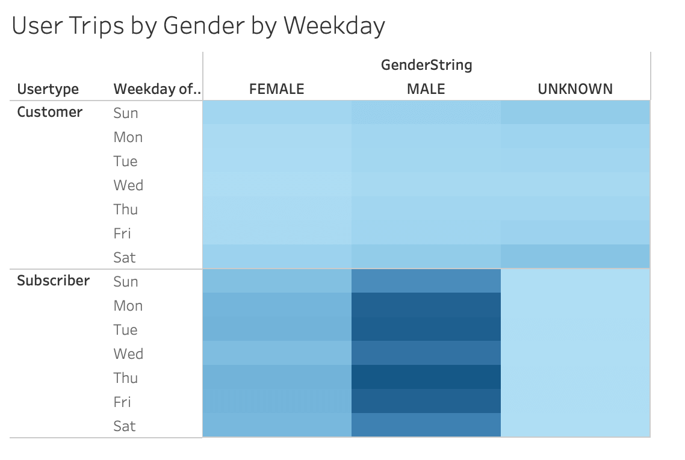
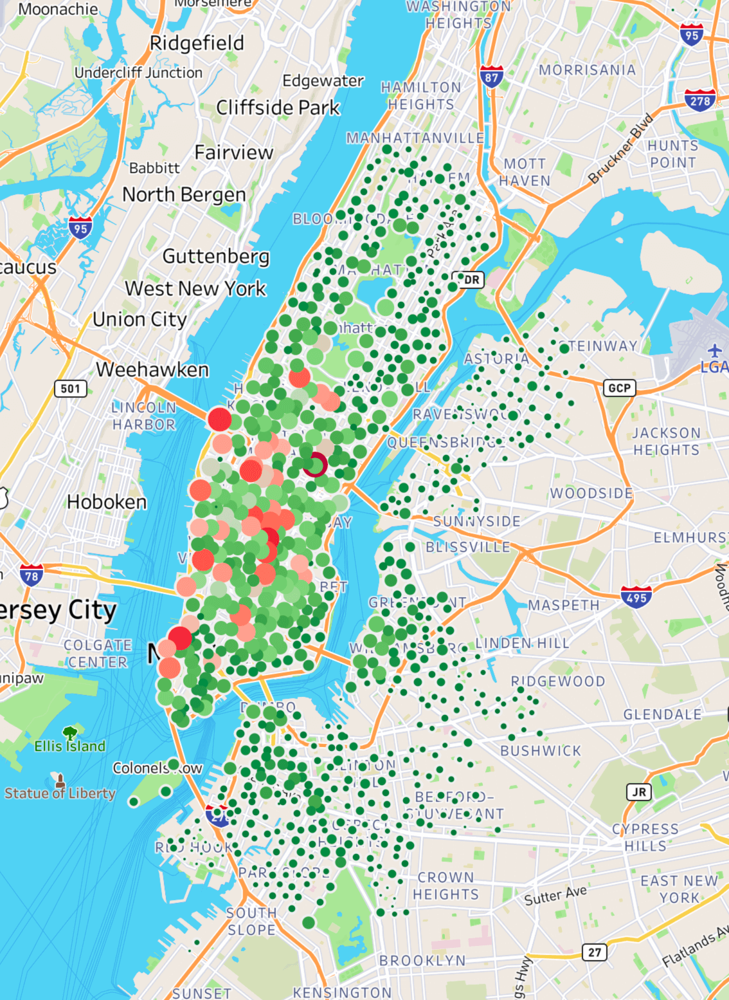
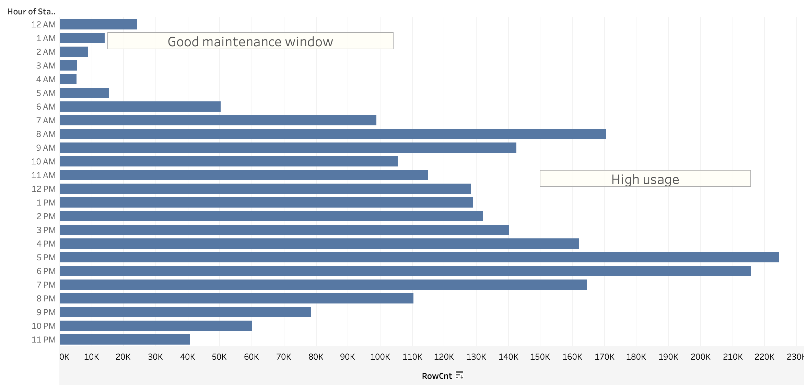
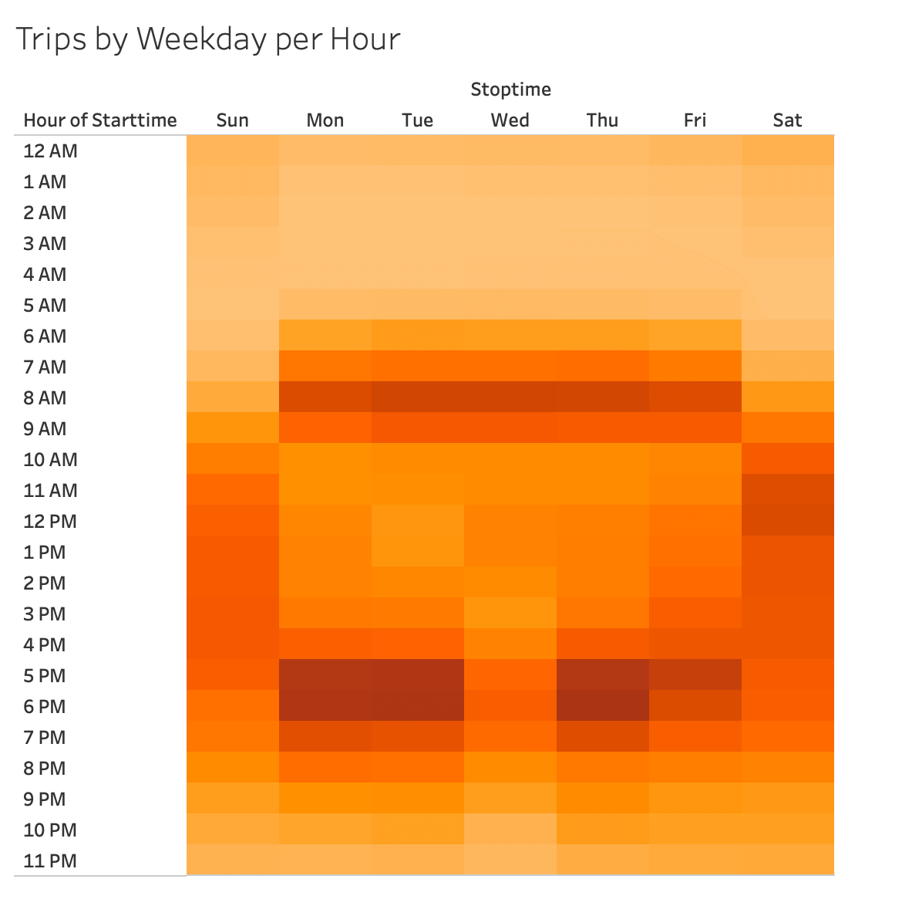
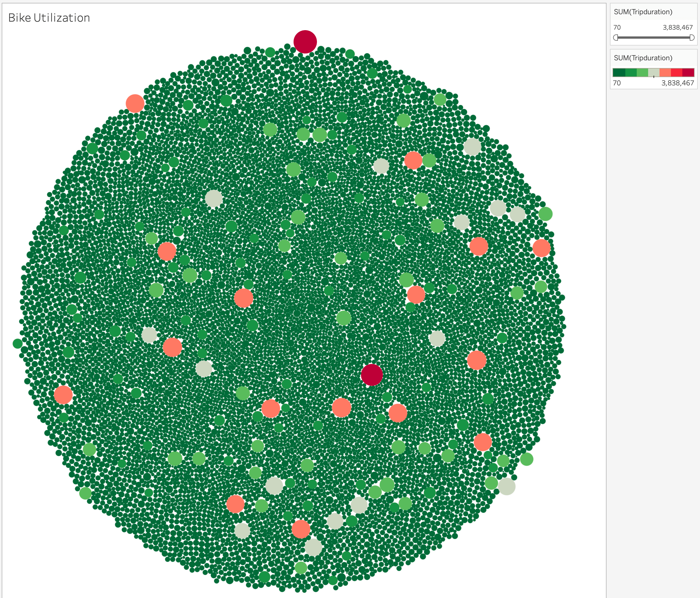
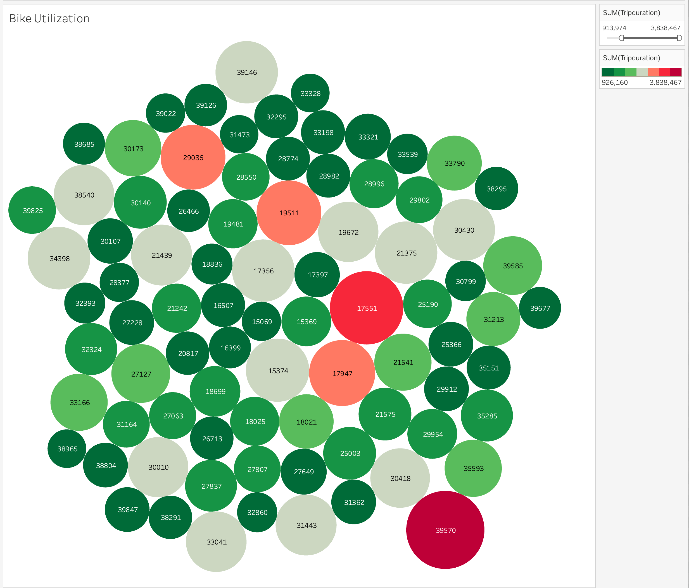

# Bikesharing

> [Link to dashboard](https://public.tableau.com/app/profile/randy.machacek/viz/NYC_Citibike_Challenge_16700944474470/NYCCitiCycle?publish=yes)

## Overview
Citi bike is one of the largest bike share programs in NYC. They make it easy for people to save money over taxi rides, save time over other modes of transportation - may time bike routes are faster than other transportation modes, allows people to have fun and get some exercise. 

Looking at the bike data provided by Citi Bike we want to get some insight into bike usage that could be used for a similar endeavor in another area. 

## Results 

#### Checkout times 
Most bikes are checked out for 60 minutes or less. 

#### Gender checkout times 
Men check out bikes for slightly longer times and more predominately check out bikes. 

### Membership vs guest usage 
Subscribers are the largest users of bikes. This could provide some a good consistent income stream. Males are also predominant users. This would be interesting to explore further to understand why and could lead to some promotion thoughts. 

#### Starting locations 
There are areas that used more heavily than others. This would be something to explore further. Are these being used by tourist more - nearby locations of business etc. 

#### Hours of use 
The most popular time of use is around 5 to 7 pm. Low usage time are early in the morning from 3 to 4 am - these could be good bike maintenance windows.

#### Popular days 
The most popular days are Monday, Tuesday and Thursday. Weekends it appears later Saturday morning to noon has the highest weekend usage. 

#### Bike usage 
Maintenance on bikes is inevitable. Some bikes are more utilized that others - these might be around higher usage areas. 

#### Highest usage bikes 
It might be of interest to track these particular bike to understand why their higher usage. 

## Summary 
A bike sharing program could be good for the community and if properly located could provide a good value stream. A subscriber model appears to be the best approach. Location of the bike would be important to assess and reevaluate as any program would move forward. A bike maintenance program would be important to make considerations for when evaluating cash flow from a subscriber model. 

Additional visualizations showing proximity of bikes to areas of interest in the community could be helpful. Breaking demographics out further - especially regarding usage by women could be helpful. Additional data to understand seasonality would be helpful. Is this a seasonal or year long program. 
